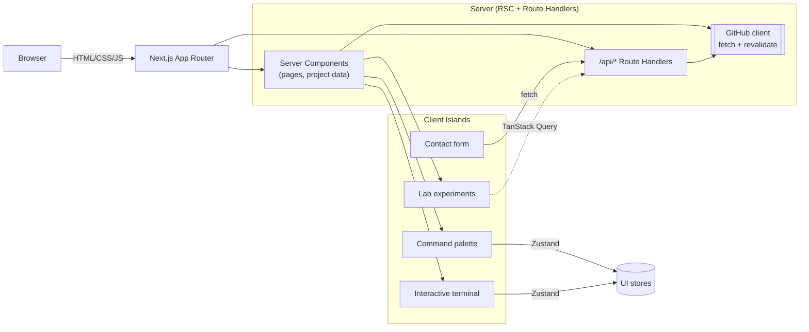

# serasalin.dev

An interactive developer OS — portfolio, engineering lab, and public API — built with
Next.js 15, React 19, and TypeScript.

Not a template. The site is designed to demonstrate how I think about frontend
architecture, state ownership, and API design in a real Next.js application.

## Highlights

- **App Router** with Server Components by default. Client islands are scoped
  to what actually needs interactivity.
- **Command palette** (⌘/Ctrl-K) with a small pluggable action registry.
- **Interactive terminal** driven by a modular command registry with history,
  autocomplete, aliases, and typed argument handling.
- **Developer Lab** with live experiments: an event-loop visualizer, a JWT
  inspector, a JSON diff viewer, and a cron explorer.
- **GitHub integration** cached on the server via Next.js fetch revalidation.
- **Public API** at `/api/*` documented under `/api/docs`.
- **Contact form** with a pluggable email provider (log by default; opt-in
  Resend integration) and per-IP rate limiting.
- **Testing** with Vitest, React Testing Library, MSW, Playwright, and
  Storybook, plus type-checked ESLint flat config.

## Architecture at a glance



## Getting started

Requires Node 24 and pnpm 10.

```bash
pnpm install
pnpm dev
```

Then open http://localhost:3000.

### Environment variables

Copy `.env.example` to `.env.local`. Every variable is optional — the app runs
without any secrets.

| Variable                 | Purpose                                                |
| ------------------------ | ------------------------------------------------------ |
| `NEXT_PUBLIC_SITE_URL`   | Absolute URL used in metadata, sitemap, and OG.        |
| `GITHUB_USERNAME`        | Username fetched for the `/github` page and API.       |
| `GITHUB_TOKEN`           | Optional PAT to raise the anonymous GitHub rate limit. |
| `CONTACT_EMAIL_PROVIDER` | `log` (default), `resend`, or `postmark`.              |
| `RESEND_API_KEY`         | Required when the provider is `resend`.                |
| `CONTACT_TO_ADDRESS`     | Destination address for `resend`.                      |

Environment variables are validated through Zod during boot. Missing or
invalid variables produce a clear error.

## Scripts

| Script                                                 | Purpose                               |
| ------------------------------------------------------ | ------------------------------------- |
| `pnpm dev`                                             | Start the Next.js dev server.         |
| `pnpm build` / `pnpm start`                            | Production build + start.             |
| `pnpm typecheck`                                       | Strict TypeScript check without emit. |
| `pnpm lint` / `pnpm lint:fix`                          | ESLint flat config.                   |
| `pnpm format` / `pnpm format:check`                    | Prettier.                             |
| `pnpm test` / `pnpm test:watch` / `pnpm test:coverage` | Vitest + RTL + MSW.                   |
| `pnpm test:e2e` / `pnpm test:e2e:ui`                   | Playwright.                           |
| `pnpm storybook` / `pnpm build-storybook`              | Storybook.                            |
| `pnpm analyze`                                         | Build with `@next/bundle-analyzer`.   |
| `pnpm validate`                                        | Format + lint + typecheck + tests.    |

## Folder structure

```text
src/
  app/                     Next.js App Router routes, layouts, api/
  components/              Cross-cutting UI (layout, navigation, seo, feedback)
  features/                Business-domain features (command-palette, terminal,
                           projects, github, lab, contact, theme)
  content/                 Typed personal content (profile, projects, skills,
                           writing, etc.) — validated with Zod
  lib/                     API errors, env, GitHub client, query, security, seo
  styles/                  Global styles + Tailwind entry
  test/                    Vitest setup + MSW handlers + provider wrappers
  theme/                   MUI theme and design tokens
e2e/                       Playwright specs
.storybook/                Storybook configuration
docs/                      Architecture notes and ADRs
```

Business logic lives in `features/*`. Components in `components/*` are
business-agnostic.

## State ownership

The application draws a clear boundary between four kinds of state.

| Kind                     | Owner                              | Examples                                      |
| ------------------------ | ---------------------------------- | --------------------------------------------- |
| Server data              | Server Components / Route Handlers | Project catalog, GitHub summary, RSS          |
| Client-side server state | TanStack Query                     | Any client-triggered fetch to `/api/*`        |
| Global UI state          | Zustand                            | Theme mode, command palette, terminal session |
| Form state               | React Hook Form                    | Contact form                                  |
| Local, non-shared state  | `useState`                         | Component-level UI toggles                    |

## Styling

- **Material UI** for accessible interactive primitives, MUI X Charts.
- **Tailwind CSS** for layout, spacing, responsive structure only.
  Tailwind's preflight is disabled so it doesn't fight MUI's CssBaseline.
- **CSS Modules** for terminal styling, code blocks, effects, and any
  component that would become unreadable as utility strings.

Design tokens live in `src/theme/tokens.ts`. The MUI theme registers CSS
variables that Tailwind then reads through the semantic color aliases
defined in `tailwind.config.ts`.

## Adding things

- **A project**: append to `src/content/projects.ts`. Everything downstream
  is data-driven.
- **A terminal command**: define a `TerminalCommand` in
  `src/features/terminal/commands/index.ts` and add it to `commandRegistry`.
- **A Lab experiment**: create `src/features/lab/<slug>/…`, register the
  entry in `src/content/lab.ts`, and add a case in
  `src/app/(site)/lab/[slug]/page.tsx`.
- **An API endpoint**: add `src/app/api/<name>/route.ts` and document it in
  `src/app/(site)/api/docs/page.tsx`.

## Deployment

Any Node 24+ platform (Vercel, Fly, Render, Docker). Set the environment
variables described above. Next.js caching handles revalidation of GitHub
data automatically — no scheduler is required.

## Documentation

Deeper writeups live under `docs/`:

- `docs/architecture.md`
- `docs/state-management.md`
- `docs/styling.md`
- `docs/testing.md`
- `docs/security.md`
- `docs/adr/*`

## License

MIT — see `LICENSE`.
